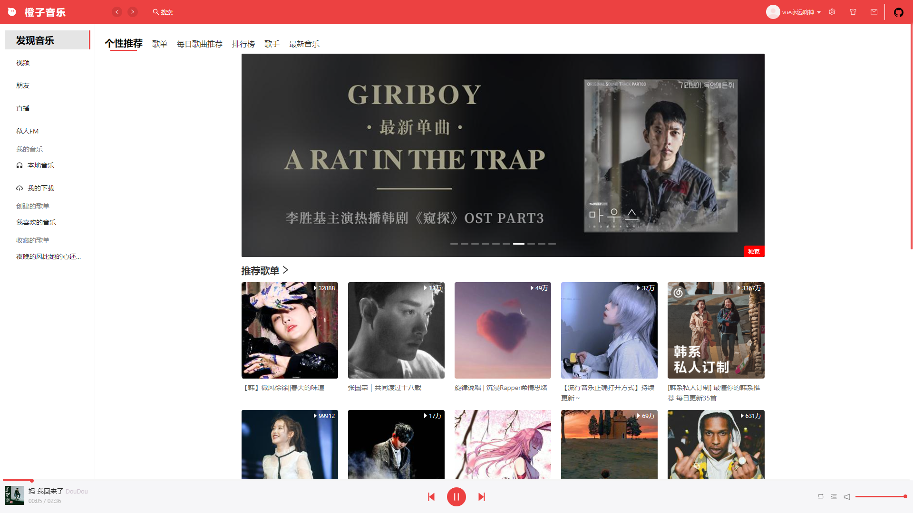
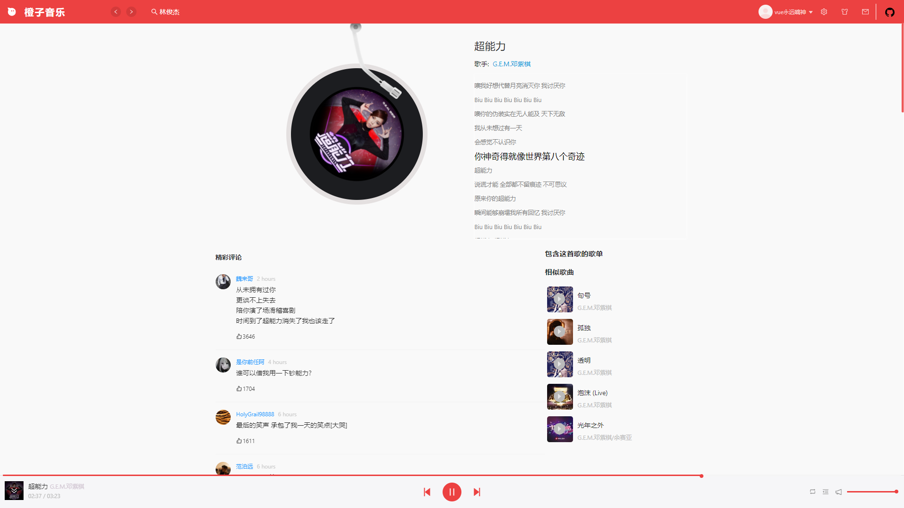
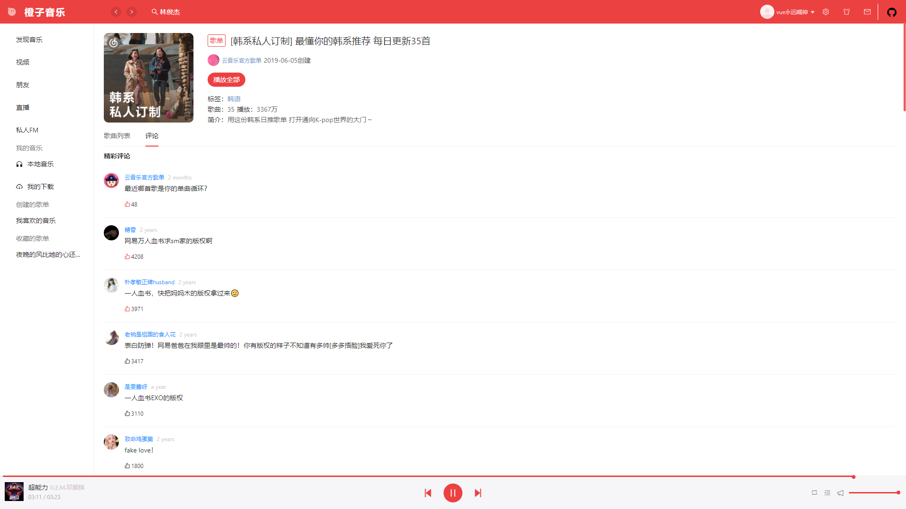

# React Cheng Music
React Cheng Music——一个基于React、TypeScript、Vite的高仿网易云mac客户端播放器。

初学者用来练习react所编写的一个项目，参考了[uniquemo/react-netease-music: React Netease Music——一个基于React、TypeScript的高仿网易云mac客户端🎵播放器。 (github.com)](https://github.com/uniquemo/react-netease-music)大佬的项目编写的。React和Ts是初学者，所以有些地方代码的编写并不正规。

## 项目体验地址
[🍊音乐 (icloudmusic.top)](http://icloudmusic.top)

## 功能列表
- [x] 登录/登出（目前仅支持手机密码登录）
- [x] 发现页
  - [x] banner
  - [x] 推荐歌单
  - [x] 推荐最新音乐
  - [x] 推荐MV（仅是入口，详情待实现）
- [x] 每日歌曲推荐页
- [x] 全部歌单页
  - [x] 歌单分类查询
- [x] 最新音乐页
- [x] 歌单详情页
- [x] 音乐播放详情页
  - [x] 歌曲评论
  - [x] 点赞/取消点赞歌曲评论
  - [x] 歌词滚动
  - [x] 歌曲所在歌单
  - [x] 相似歌曲推荐
- [x] 播放记录功能
  - [x] 播放列表
  - [x] 历史记录
- [x] 搜索功能
  - [x] 热门搜索关键字
  - [x] 搜索建议
  - [x] 搜索结果页
- [x] 创建的歌单列表
- [x] 收藏的歌单列表
- [x] 排行榜
- [x] 主题换肤（简易版换主题色）
- [ ] 所有歌手页
- [ ] 歌手详情页
- [ ] MV相关的页面与功能
- [ ] 创建/编辑/删除歌单
- [ ] 私信/@我/评论等通知功能

注意：部分歌曲可能由于版权问题无法播放喔。

## 技术栈
- React，使用Mobx做状态管理。
- TypeScript，用TypeScript确实可以提高效率😃（容易发现错误）。
- antd 组件库。
- Less。
- Vite。
- Eslint做代码检查。

## API接口
[NeteaseCloudMusicApi](https://binaryify.github.io/NeteaseCloudMusicApi)

## 播放器的相关截图








## 项目启动

```
yarn
yarn dev
```
在浏览器中访问：`http://localhost:8080`
